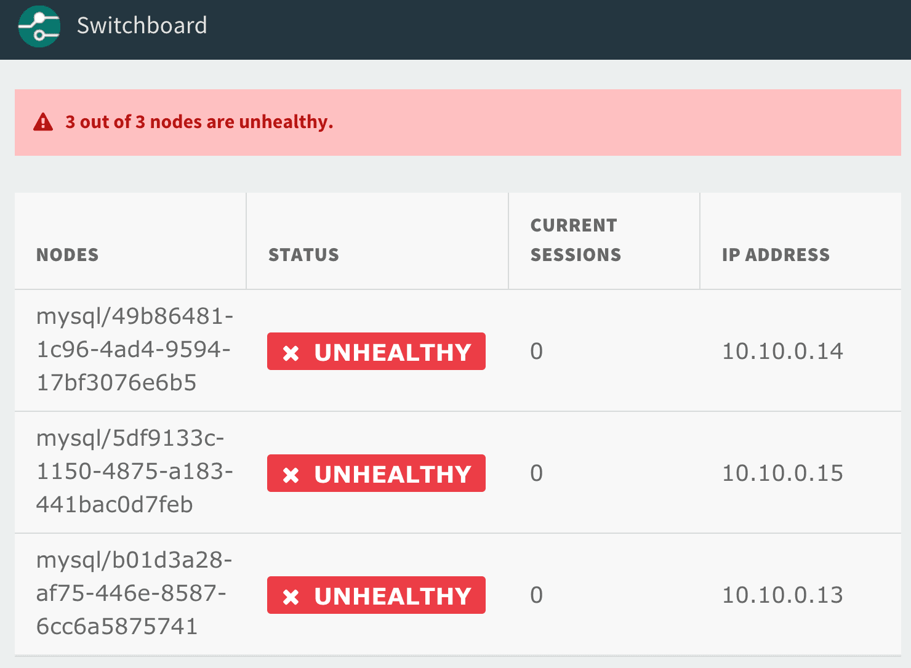

# Bootstrapping a Percona XtraDB Cluster

Bootstrapping is the process of (re)starting a Percona XtraDB Cluster deployment.

## When to Bootstrap

Bootstrapping is only required when the cluster has lost quorum.

Quorum is lost when less than half of the nodes can communicate with each other (for longer than the configured grace period). In Galera terminology, if a node can communicate with the rest of the cluster, its DB is in a good state, and it reports itself as ```synced```.

If quorum has *not* been lost, individual unhealthy nodes should automatically rejoin the cluster once repaired (error resolved, node restarted, or connectivity restored).

#### Symptoms of Lost Quorum

- All nodes appear "Unhealthy" on the proxy dashboard:

  

- All responsive nodes report the value of `wsrep_cluster_status` as `non-Primary`.

    ```sh
    mysql> SHOW GLOBAL STATUS LIKE 'wsrep_cluster_status';
    +----------------------+-------------+
    | Variable_name        | Value       |
    +----------------------+-------------+
    | wsrep_cluster_status | non-Primary |
    +----------------------+-------------+
    ```

- All responsive nodes respond with `ERROR 1047` when queried with most statement types.

    ```bash
    mysql> SELECT 1 FROM mysql.db;
    ERROR 1047 (08S01): WSREP has not yet prepared node for application use
    ```

See [Cluster Behavior](cluster-behavior.md) for more details about determining cluster state.

## Auto-bootstrap errand

pxc-release includes a `bootstrap` errand for automating the quorum recovery process.

The errand evaluates if quorum has been lost on a cluster, and if so bootstraps
the cluster. Before running the errand, one should ensure that there are no
network partitions. Once network partitions have been resolved, the cluster is
in a state where the errand can be run.

#### How to run

Run `bosh run-errand bootstrap` from the terminal. When done, this should
successfully bootstrap the cluster, and all jobs should report as `running`.
Note that:

If the cluster was already healthy to begin with (i.e. quorum was never lost),
the errand will error out saying `bootstrap is not required`.

If one or more nodes are not reachable (i.e. the VM exists but in an unknown
state), it will error out saying `Error: could not reach node`. In this
situation, follow the steps below:

1. `bosh -n stop mysql`

2. `bosh -n start mysql/0 ; bosh -n start mysql/1 ; bosh -n start mysql/2`
   ```bash
   $ bosh -n start --no-converge mysql/0;
     bosh -n start --no-converge mysql/1;
     bosh -n start --no-converge mysql/2
   ```

   The "post-start" operation will fail on each vm, but it ensures that all the
   mysql jobs are configure properly on each VM.

3. Try running the errand again using `bosh -n run-errand bootstrap` as above.

   Once the errand succeeds, the cluster is synced, although some jobs might still
   report as failing.

4. Verify that deployment succeeds and all jobs are healthy. A healthy deployment should look like this:

   ```bash
   $ bosh instances --column="Instance" --column="Process State"
   Deployment 'pxc'
   Instance                                    Process State
   mysql/31226cce-67f6-4c5c-beda-c914d8f70259  running
   mysql/91595e37-b9f0-404c-a653-8358e816eee2  running
   mysql/c09bd332-74c3-4126-855c-9135eb189db0  running
   proxy/52ca75b8-ff63-4cfc-82ea-3e9bec4a8ef3  running
   proxy/f175379c-d78c-42d6-8877-8fe8ae042966  running
   ```

If these steps did not work for you, please refer to the [Manual Bootstrap Process](#manual-bootstrap-process) below.

## How it works

The bootstrap errand simply automates the steps in the manual bootstrapping process documented below. It finds the node with the highest transaction sequence number, and asks it to start up by itself (i.e. in bootstrap mode), then asks the remaining nodes to join the cluster.

The sequence number of a stopped node can be retained by either reading the node's state file under `/var/vcap/store/mysql/grastate.dat`, or by running a mysqld command with a WSREP flag, like `mysqld --wsrep-recover`.

## Manual Bootstrap Process

The following steps are prone to user-error and can result in lost data if followed incorrectly.
Please follow the [Auto-bootstrap](#auto-bootstrap-errand) instructions above first, and only resort to the manual process if the errand fails to repair the cluster.

1. SSH to each node in the cluster and, as root, shut down the mysql process.

  ```sh
  $ monit stop galera-init
  ```

Re-bootstrapping the cluster will not be successful unless all other nodes have been shut down.

1. Choose a node to bootstrap.

   Find the node with the highest transaction sequence number (seqno):

    - If a node shutdown gracefully, the seqno should be in the galera state file.

        ```sh
        $ cat /var/vcap/store/mysql/grastate.dat | grep 'seqno:'
        ```

    - If the node crashed or was killed, the seqno in the galera state file should be `-1`. In this case, the seqno may be recoverable from the database. The following command will cause the database to start up, log the recovered sequence number, and then exit.

        ```sh
        $ /var/vcap/jobs/pxc-mysql/bin/get-sequence-number
        ```

      Note: The galera state file will still say `seqno: -1` afterward.

    - If the node never connected to the cluster before crashing, it may not even have a group id (uuid in grastate.dat). In this case there's nothing to recover. Unless all nodes crashed this way, don't choose this node for bootstrapping.

   Use the node with the highest `seqno` value as the new bootstrap node. If all nodes have the same `seqno`, you can choose any node as the new bootstrap node.

**Important:** Only perform these bootstrap commands on the node with the highest `seqno`. Otherwise the node with the highest `seqno` will be unable to join the new cluster (unless its data is abandoned). Its mysql process will exit with an error. See [cluster behavior](cluster-behavior.md) for more details on intentionally abandoning data.

1. On the new bootstrap node, update state file and restart the mysql process:

   ```sh
   $ echo -n "NEEDS_BOOTSTRAP" > /var/vcap/store/mysql/state.txt
   $ monit start galera-init
   ```

   You can check that the mysql process has started successfully by running:
   ```bash
   $ watch monit summary
   ```

   It can take up to 10 minutes for monit to start the mysql process.

2. Once the bootstrapped node is running, start the mysql process on the remaining nodes via monit.

   ```bash
   $ monit start galera-init
   ```

3. Verify that the new nodes have successfully joined the cluster. The following command should output the total number of nodes in the cluster:

   ```bash
   $ mysql --defaults-file=/var/vcap/jobs/pxc-mysql/config/mylogin.cnf
   mysql> SHOW STATUS LIKE 'wsrep_cluster_size';
   ```
